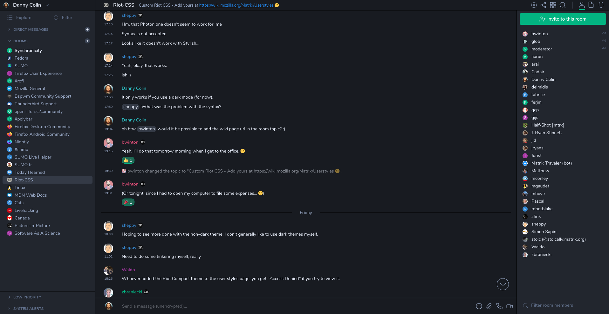

# Element Compact

A userstyle for Element Web with the goal to maximize the content you can see.

[][screenshot]

## Installation

You'll need to:

1. Install Stylus ([Firefox][stylus-ff], [Chrome][stylus-cr])
1. Install [Element Compact][install-github]

<!--
You can also [install this theme from UserStyle.org][install-userstyle].
-->

## Contributing

If you'd like to help developing or maintaning this theme, you can contact me in
the [#riot-css:mozilla.org channel][riot-css] on
[the official Mozilla Matrix server][mozilla-matrix].

## License

Copyright (c) 2019-2020 Danny Colin

This Source Code Form is subject to the terms of the Mozilla Public License,
v. 2.0. If a copy of the MPL was not distributed with this file, You can obtain
one at http://mozilla.org/MPL/2.0/.

[install-github]: https://raw.githubusercontent.com/dannycolin/element-compact/master/element-compact.user.css
[install-userstyle]: https://userstyle.org
[mozilla-matrix]: https://chat.mozilla.org
[screenshot]: https://raw.githubusercontent.com/dannycolin/riot-compact/master/screenshot.png
[stylus-cr]: https://chrome.google.com/webstore/detail/stylus-beta/apmmpaebfobifelkijhaljbmpcgbjbdo
[stylus-ff]: https://addons.mozilla.org/en-US/firefox/addon/styl-us/
[riot-css]: https://matrix.to/#/!lBPRDCcyNCozZeDGbX:mozilla.org?via=mozilla.org
